# LLM Proxy Agency Platform

When someone asks ChatGPT "where can I buy a watch strap in Sweden?", the answer comes from content GPTBot crawled weeks ago. If that content was a wall of JavaScript-rendered noise — cookie banners, nav menus, Shopify boilerplate — the model either ignores it or cites it poorly.

This platform sits transparently in front of a client's website. Human visitors see nothing different. AI crawlers get a structured, schema-annotated version of each page: clean headings, Q&A pairs extracted from content, schema.org markup, and entity data the model can quote directly. The goal is to increase the rate at which AI systems cite the client accurately.

It also records every crawler hit, what it saw, and what transformation was applied — giving clients the first half of a feedback loop. The second half (citation monitoring across ChatGPT, Perplexity, Claude) is the next build phase.

---

## Live Infrastructure

| Component | Runtime | URL |
|---|---|---|
| `proxy-core` | Cloudflare Workers (edge, global) | `llm-proxy-core.staffan-greisz.workers.dev` |
| `render-service` | Node.js on Railway (EU West) | `geotool-production-4198.up.railway.app` |
| Redis | Railway managed | internal to render-service |

---

## How It Works

```
AI Crawler hits client domain
        │
        ▼
Cloudflare Worker (proxy-core)
        │
        ├─ Bot fingerprint check (UA + IP range + PTR DNS + behaviour)
        │     Confidence score: UA=30pts  IP=40pts  PTR=20pts  Behaviour=10pts
        │     Threshold: ≥70 to be "verified"
        │
        ├─ Honeypot? ──→ 200 OK + log hit (39 exact trap paths + 4 prefix traps)
        │
        ├─ Verified bot
        │     ├─ Cache hit  ──→ pre-rendered HTML served instantly
        │     │                 x-llm-proxy-cache: HIT
        │     └─ Cache miss ──→ fetch origin → transform → serve
        │                       x-llm-proxy-processed: true
        │                       x-llm-proxy-page-type: product|blog|faq|...
        │                       x-llm-proxy-entities: <count>
        │
        └─ Human ──→ passthrough, zero modification
                │
                └─ Bot event POST'd to render-service /events (non-blocking)

render-service (Railway)
        ├─ /render   — check Redis cache → queue Puppeteer job → return HTML
        ├─ /events   — receive bot hit events → store in Redis list
        ├─ /stats    — aggregate events by bot, page type, URL, day (auth + rate-limited)
        └─ /health   — readiness probe
```

---

## Packages

| Package | Runtime | Purpose |
|---------|---------|---------|
| `proxy-core` | Cloudflare Workers | Bot detection + content transformation at the edge |
| `render-service` | Node.js | JS pre-renderer (Puppeteer + BullMQ) + event store |
| `data-layer` | Node.js | Analytics pipeline: EventPublisher, ClickHouseWriter, CitationTracker, AnomalyDetector |
| `dashboard` | React | Client-facing analytics UI (in progress) |
| `evals` | Node.js | Binary pass/fail evaluation suite |



---

## Bot Detection

Multi-factor confidence scoring on every request:

| Signal | Points | Method |
|---|---|---|
| User-Agent match | 30 | Pattern-matched against known bot registry |
| IP range | 40 | CIDR lookup in KV, auto-refreshed every 6h from vendor endpoints |
| PTR record | 20 | Reverse DNS via Cloudflare DoH, verifies PTR ends with expected domain |
| Behaviour | 10 | Header consistency check — `false` if the request carries browser-only headers (`sec-fetch-*`, `image/webp` Accept) alongside a bot UA, indicating spoofing |
| **Threshold** | **≥70** | Below this = unverified = passthrough |

The behaviour check catches the most common spoofing pattern: a human browser claiming to be a known crawler. A real GPTBot request never sends `sec-fetch-mode` or an `image/avif` Accept header. When those appear, `behaviorNormal` is set to `false` and the 10 points are withheld. `DetectionResult` includes a `behaviorSignals` array for observability.

JA3/JA4 TLS fingerprints are captured on every verified hit and logged with the event.

---

## Honeypot

39 exact trap paths plus 4 prefix traps are checked before any bot scoring. A hit returns `200 OK` (no information leak) and logs a structured `HoneypotHit` event with IP, UA, path, and all headers.

Exact path categories: LLM/AI dataset dumps (`/training-data/raw.jsonl`, `/llm-index.json`, `/fine-tune-data.jsonl`, `/embeddings/index.json`…), internal API endpoints (`/api/internal/debug`, `/api/v1/admin/export`…), credential/config traps (`/.env`, `/.git/config`, `/secrets.json`…), CMS traps (`/wp-login.php`, `/xmlrpc.php`…), data export traps (`/dump.sql`, `/exports/all-users.json`, `/backup/db-dump.sql`…).

Prefix traps catch any sub-path under:

| Prefix | Intent |
|---|---|
| `/.git/` | Git internals — no production site should expose these |
| `/llm-data/` | Synthetic AI dataset trap |
| `/ai-training/` | Synthetic AI training data trap |
| `/internal-tools/` | Synthetic internal tooling trap |

A determined crawler that maps `sitemap.xml` first will find none of these paths there — they are never linked from any legitimate content.

---

## Content Transformation

Applied to verified bots on cache miss:

1. **HTML parsing** — raw HTML → structured content tree
2. **Page classification** — heuristic scoring (URL signals + content signals) overridden by `server-timing: pageType;desc="..."` when the origin provides it (Shopify, Cloudflare, etc.)
3. **Schema.org injection** — Article / Product / FAQPage / Organization based on classified page type
4. **Q&A atomization** — H2/H3 headings that look like questions wrapped with `schema.org/Question` markup
5. **Entity extraction** — brand names, product names, prices, locations tagged

---

## Event Pipeline

Every verified bot hit fires a non-blocking POST to `render-service/events`:

```json
{
  "botId": "gptbot",
  "botName": "GPTBot",
  "confidence": 70,
  "url": "https://client.com/products/strap-red",
  "pageType": "product",
  "transformationApplied": true,
  "timestamp": "2026-05-06T21:18:26.000Z",
  "ip": "74.7.175.130",
  "fingerprint": "abc123..."
}
```

Events are stored as a Redis list (capped at 10,000 entries). The `/stats` endpoint aggregates them. Set `STATS_API_KEY` to require authentication; the endpoint is also rate-limited to 60 requests/minute per IP by default.

```
GET /stats?days=30&hostname=client.com
Authorization: Bearer <STATS_API_KEY>

{
  "total": 142,
  "since": "2026-04-06T...",
  "byBot": { "gptbot": 98, "claudebot": 44 },
  "byPageType": { "product": 110, "blog": 32 },
  "topPages": [{ "url": "...", "count": 23 }, ...],
  "byDay": [{ "date": "2026-05-01", "count": 12 }, ...]
}
```

ClickHouse is the intended long-term store. The `data-layer` package has `ClickHouseWriter` ready — swap the Redis sink once a ClickHouse instance is provisioned.

---

## Pre-Rendering

- **Puppeteer** with `domcontentloaded` wait strategy (15s timeout)
- **BullMQ** queue with concurrency=4
- **Cache key:** SHA256 of normalised URL, **TTL:** 4 hours
- **ETag diffing:** on cache hit, HEAD the origin and compare ETags — invalidate and re-queue if content has changed

---

## Getting Started

### Prerequisites

- Node.js 20+
- Redis (local dev) or Railway Redis addon (production)
- Cloudflare account with Workers enabled

### Install

```bash
npm install
```

### Local development

```bash
# Terminal 1 — Redis
redis-server

# Terminal 2 — render-service
cd render-service && npm run build && npm start

# Terminal 3 — Cloudflare Worker
cd proxy-core && npm run dev
```

Worker starts on `http://localhost:8787`, proxies to `https://baraband.se` by default.

### Tests and lint

```bash
npm test        # all workspaces
npm run lint    # tsc --noEmit across all workspaces

# Single test file
npx vitest run src/path/to/file.test.ts
```

---

## Environment Variables

**render-service:**

| Variable | Default | Description |
|---|---|---|
| `REDIS_URL` | — | Full Redis URL (Railway injects this automatically) |
| `REDIS_HOST` | `localhost` | Fallback host when REDIS_URL is not set |
| `REDIS_PORT` | `6379` | Fallback port |
| `PORT` | `3001` | HTTP server port |
| `CHROME_PATH` | — | Chromium binary path (set in Dockerfile to `/usr/bin/chromium`) |
| `STATS_API_KEY` | — | If set, `/stats` requires `Authorization: Bearer <key>` or `X-Api-Key: <key>`. Unset = open (dev/internal use only) |
| `CLICKHOUSE_URL` | — | ClickHouse HTTP endpoint (e.g. `https://host:8443`). When set alongside `CLICKHOUSE_DATABASE`, events are dual-written to ClickHouse in addition to Redis |
| `CLICKHOUSE_DATABASE` | — | ClickHouse database name for bot event storage |
| `CLICKHOUSE_USER` | `default` | ClickHouse username |
| `CLICKHOUSE_PASSWORD` | — | ClickHouse password |

**proxy-core (`wrangler.toml`):**

| Variable | Description |
|---|---|
| `RENDER_SERVICE_URL` | render-service base URL |
| `UPSTREAM_URL` | Default origin for human passthrough |

**KV namespaces:**

| Binding | Purpose |
|---|---|
| `BOT_REGISTRY` | IP range data per bot ID, auto-refreshed every 6h |
| `RENDER_CACHE` | Reserved for edge-cached rendered pages |
| `CLIENT_REGISTRY` | Per-hostname client config (upstreamUrl, renderServiceUrl) |

---

## Deployment

```bash
# Cloudflare Worker
cd proxy-core && npx wrangler deploy

# render-service — Railway auto-deploys from main branch push
git push origin master:main
```

---

## Multi-Tenancy

The worker reads the request `host` header on every request and looks up `client-config:<hostname>` in `CLIENT_REGISTRY` KV. If a config exists, it overrides `UPSTREAM_URL` and `RENDER_SERVICE_URL` for that request.

To onboard a client:

```bash
npx wrangler kv key put --remote \
  --namespace-id=<CLIENT_REGISTRY_ID> \
  "client-config:client-domain.com" \
  '{"upstreamUrl":"https://origin.client-domain.com","renderServiceUrl":"https://geotool-production-4198.up.railway.app"}'
```

Then point the client's DNS to the worker (Cloudflare for SaaS or worker route on their zone).

---

## Testing Bot Detection

Spoof a GPTBot request with an IP in the published OpenAI CIDR range (UA=30pts + IP=40pts = 70pts, verified):

```powershell
curl.exe -s https://llm-proxy-core.staffan-greisz.workers.dev/ `
  -H "User-Agent: Mozilla/5.0 (compatible; GPTBot/1.1; +https://openai.com/gptbot)" `
  -H "x-forwarded-for: 74.7.175.130" -I
```

In production, `cf-connecting-ip` takes precedence over `x-forwarded-for` — spoofing only works in local `wrangler dev`.

---

## Build Phases

| Phase | Status |
|---|---|
| 00 Foundation | ✅ Done |
| 01 Bot Detection | ✅ Done |
| 02 JS Pre-Renderer | ✅ Deployed on Railway |
| 03 Content Transform | ✅ Done |
| 04 Data Pipeline | ✅ Done |
| 05 Dashboard | 🔲 Not started |
| 06 Production Hardening | 🔲 Not started |
| 07 First Client | 🔲 Not started |
